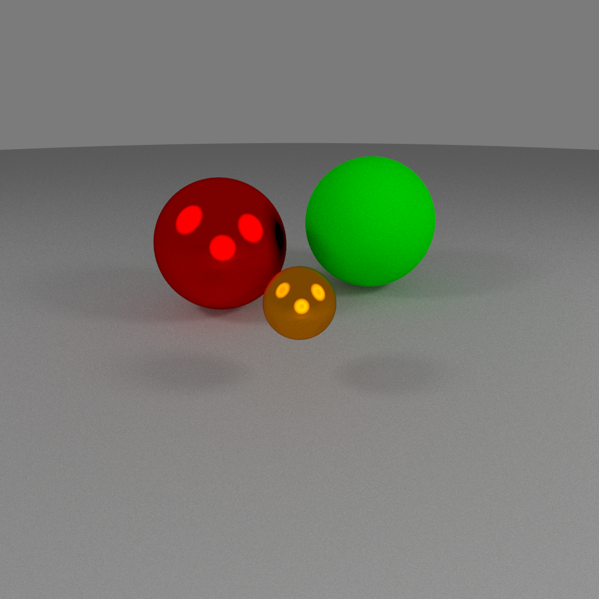
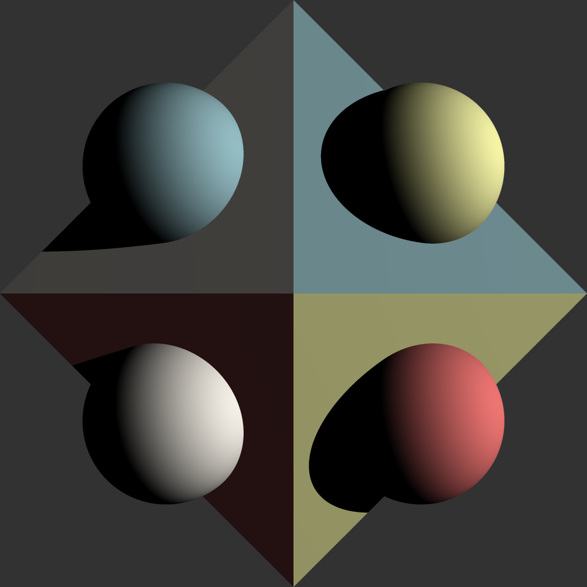
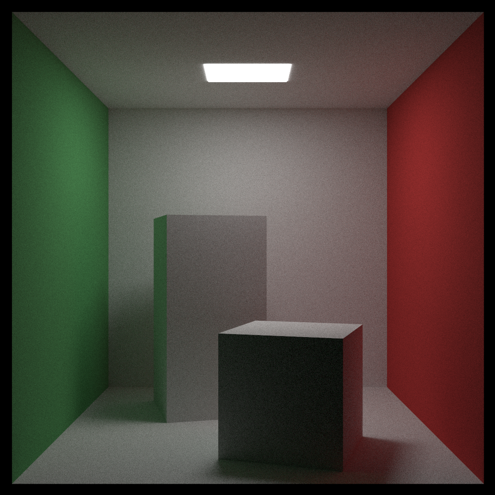
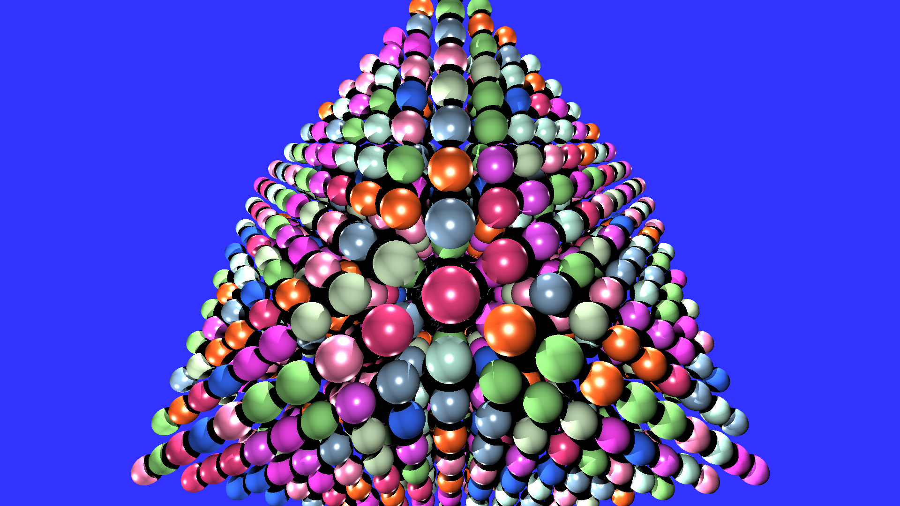

# Raytracer

## Setting up

### Build CLI
`cargo build -p raytracer-cli --release`

### Build only the library crate for WASM by running
`cargo build -p raytracer-lib --target wasm32-unknown-unknown`

## Main Goals
- Recreate my [raytracer](https://github.com/reecelikesramen/raytracer) project from CS 4212 Computer Graphics in Rust.
- Separate the CLI and the core library, enable the library to compile to WASM and invoke from the web browser.
- Optimize the raytracer with SIMD and CUDA (separate versions) to increase exposure to low-level parallelization.
- Extend the raytracer with more interesting shaders, shapes, and light types.

## Examples
Note: the following scenes were created by Dr. Pete Willemsen at University of Minnesota Duluth.

Simple sphere scene:

Spheres and triangles:

Cornell Room:

1000 spheres:

Cityscape:
