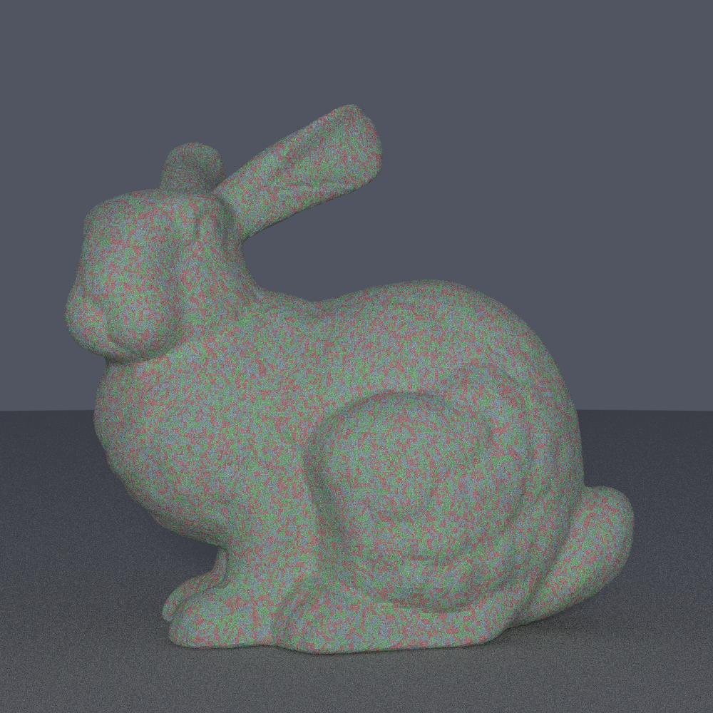

# WebTracer: A Rust & WASM Ray tracing Engine
Currently implementing forward ray tracing

## Setting up

### Build CLI for regular use
`cargo build -p raytracer-cli --release`

### Build the WASM binding (in the web-test branch)
```sh
cd raytracer-wasm
wasm-pack build --target web --out-dir ../web-test/pkg --release
cd ../web-test
python -m http.server
```
Open http://localhost:8000

## Main Goals
- [x] Learn Rust fundamentals by recreating my [raytracer](https://github.com/reecelikesramen/raytracer) project from CS 4212 Computer Graphics in Rust.
- [x] Separate the CLI and the core library, enable the library to compile to WASM and invoke from the web browser.
- [ ] Optimize the raytracer by parallelizing math operations to increase exposure to low-level optimization.
- [ ] Extend the raytracer with more interesting shaders, shapes, and light types.

## Renders
Note: the following scenes were created by Dr. Pete Willemsen at University of Minnesota Duluth.

CLI args for all renders here: `raytracer-cli --width 1000 --height 1000 --rays-per-pixel 9 --recursion-depth 6`

Simple sphere scene:


Spheres and triangles:


Cornell Room:


1000 spheres:


Cityscape:


Stanford bunny:


## TODO
 - Instanced models [model done]
 - Transforms for instanced models [model done]
 - Textures [model done]
 - Diffuse, specular can be texture or color [model done]
 - ParsedScene doesn't need a shaders map
 - SceneArgs container for disable_shadows, recursion_depth, image_width, image_height, etc...
 - Background structure for either background_color or env_map
 - Impl scene stuff so its not just public members
 - MTL parsing into shaders
 - Vectors that must be normalized can be wrapped in na::Unit